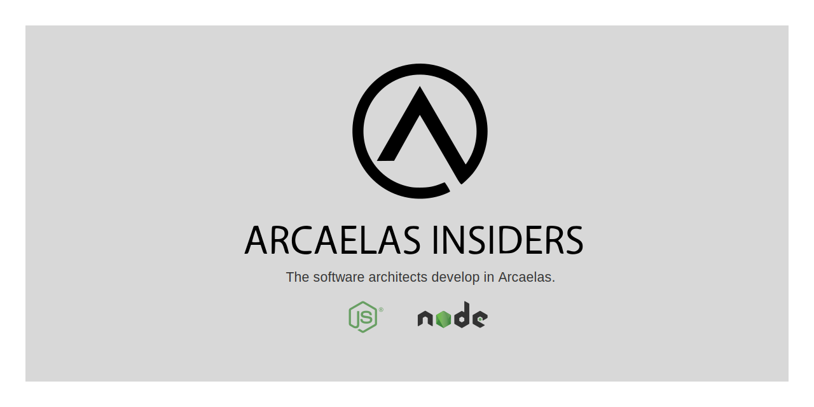

   

 

     

   

# 👋 ¡Hey, i there using my brain!

> 🌎 Currently I do not belong to any company and for this reason I have dedicated my time to develop software for **everyone on world**.

🚧 I am also the maintainer of "arcaela", a small project aimed at creating useful tools for development, among the languages ​​we handle we can mention PHP and JavaScript and I contribute to multiple projects of others developers.

I am a fan of frameworks, but I consider myself a strong developer in PHP and JavaScript without using any framework.

> If you have already seen part of our project, I encourage you to be part of it, you can fork the repository and make the "pull request".

## Goals for 2022
- Launch the second version of @arcaela
- Contribute to more open source projects that I use.
    > I want to contribute to all the main parts of my tech stack.
- Travel more and visit friends I've made through open source in Medellin, San Antonio (🇨🇱),  Madrid (🇪🇸), and the NSA 😞

 

## Personal Open Source Projects

These are projects I work on myself in my free time.

- [@arcaela/aliasses](https://github.com/arcaela/arcaela/aliasses) - Empathize with your module imports, using aliases.
- [@arcaela/command](https://github.com/arcaela/arcaela/command) - If you are one of those who like to use terminals, you can create your own native commands using "command".
- [@arcaela/eloquent](https://github.com/arcaela/arcaela/eloquent) - Searching, filtering and mapping collections is the bread and butter for developers, that's why we offer you "eloquent".
- [@arcaela/fs](https://github.com/arcaela/arcaela/fs) - Managing files and directories becomes a complicated task, between Promises and Catchers, but with FS you can use the best features of NodeJS synchronously.
- [@arcaela/logger](https://github.com/arcaela/arcaela/logger) - Printing text in the terminal, creating load and progress buffers, is easier using "Logger".
- [@arcaela/string](https://github.com/arcaela/arcaela/string) - Manipulating text strings is now easier.
- [@arcaela/xhrequest](https://github.com/arcaela/arcaela/xhrequest) - In addition to AJAX, FETCH, AXIOS and different request libraries, XHRequest allows you to create and use your own request drivers.
- [@arcaela/utils](https://github.com/arcaela/arcaela/utils) - A small box of tools, which are implemented in different factions of the library.

 

> ¿Want to discuss any of my open source projects, or something else? Send me a direct message on [Instagram](https://instagram.com/arcaelas).

> If you already use these libraries and want to support us to continue development, you can sponsor us at [Github Sponsors](https://github.com/sponsors/arcaela).